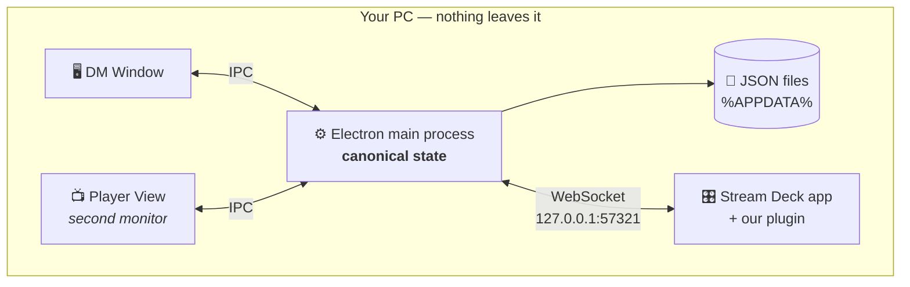

<div align="center">

# ⚔️ D&D Combat Tracker

**A Windows desktop app for Dungeon Masters to run D&D combat — with a second-monitor
Player View and an Elgato Stream Deck plugin for hardware turn, HP and condition control.**

Everything runs on one machine. No network, no cloud, no accounts, no telemetry.


</div>

> [!NOTE]
> **This project was built with AI.** The application code, the Stream Deck plugin,
> the build tooling and this README were written by [Claude](https://claude.com/claude-code)
> (Anthropic), working from my specifications and iterative feedback across many rounds
> of review and testing. I directed the design, tested every feature against real
> hardware, and reviewed the result — but I did not hand-write the source.
> Treat it accordingly: it works and it is tested, and it has not had the kind of
> line-by-line human audit you might assume from a repository this size.

---

## Contents

- [What it does](#what-it-does)
- [Install](#install)
- [How it fits together](#how-it-fits-together)
- [Using the app](#using-the-app)
- [Stream Deck plugin](#stream-deck-plugin)
- [Build from source](#build-from-source)
- [Monster data & license](#monster-data--license)
- [Behaviour notes](#behaviour-notes)

---

## What it does

|  | |
| --- | --- |
| 🧙 **Party & monster libraries** | PCs with HP/AC/initiative; 331 SRD 5.2.1 monsters importable in one click, with ability scores and fully structured attacks. Add your own too. |
| 📋 **Encounter templates** | Reusable monster + quantity sets (4× Goblin Warrior, 1× Bugbear). Start combat straight from a card. |
| ⚔️ **Combat engine** | Initiative rolling (all, or monsters-only), drag-to-settle ties, live HP and conditions, mid-combat monster adds, attack resolution vs AC with crits and save-for-half. |
| 📺 **Player View** | Display-only second-monitor window. Monsters show no numbers — just a progressive "bloodied" reddening. Auto-fits any actor count. **Styled for chroma keying.** |
| 🎛️ **Stream Deck plugin** | Turn control, damage/heal numpad, multi-actor conditions, monster attack rolls, and a dice roller — all on hardware keys that render their own labels. |
| 🎨 **Themes** | PHB Style (default), Default Electron, Dark, Light. |
| 💾 **Local-only storage** | Plain JSON in `%APPDATA%`, written atomically. Your data never leaves the machine. |

---

## Install

Grab both files from the [**latest release**](../../releases/latest):

1. **App** — run `DnD Combat Tracker Setup 1.0.0.exe` (NSIS installer, choose your own directory).
2. **Stream Deck plugin** — double-click `com.dmtools.dnd-combat-tracker.streamDeckPlugin`;
   the Stream Deck app installs it and registers the bundled picker profiles.
3. Start the app. The plugin connects within a few seconds — the DM window's sidebar
   shows **● Stream Deck connected**.

The app works standalone; the plugin needs the app running to do anything.

**Requirements:** Windows 10/11, and Stream Deck software 6.5+ (tested on 7.4) for the plugin.

<details>
<summary><b>Pairing details / port conflicts</b></summary>

- The app hosts a WebSocket server on `127.0.0.1:57321` (fixed default, hard-coded on
  both sides). Normally there is nothing to configure.
- **Port already in use?** Change it in the app under **Settings → Stream Deck bridge**,
  then set the same port on any of the plugin's actions (click the key in the Stream Deck
  app → its inspector has *Tracker app bridge port*).
- The plugin retries every 3 s forever, so the app and the plugin can start in any order.

</details>

---

## How it fits together



The main process owns the only copy of the truth. Both windows and the plugin are
views onto it, and every change is written to disk atomically (temp file + rename)
as it happens.

### Repository layout

| Path | What it is |
| --- | --- |
| `app/` | Electron + TypeScript + React app (DM Window + Player View) |
| `plugin/` | Stream Deck plugin (Elgato SDK v2, TypeScript) |
| `app/srd-source/` | Open5e dataset fixtures the monster importer compiles from |
| `app/resources/srd/` | Generated `monsters.json`, bundled into the installer |

Build outputs (`node_modules`, `app/out`, `app/release`, `plugin/dist`,
`plugin/…sdPlugin/bin`) are gitignored. Shippable artifacts are published as
[release assets](../../releases), not committed.

---

## Using the app

**Themes** live under Settings → Appearance: **PHB Style (Default)** (parchment and
dark-red headings, styled after official 5e books / Homebrewery), **Default Electron**
(the original dark-purple look), **Dark**, and **Light**. Preset-only by design — the
Player View keeps its own styling and background-colour setting.

<details open>
<summary><b>1 · Party</b></summary>

Add your PCs — name, max HP, AC, initiative modifier. Persists between sessions.

</details>

<details>
<summary><b>2 · Monsters</b></summary>

Click **Import SRD Monsters** for 331 SRD 5.2.1 monsters with ability scores and
attacks, or add your own. The six ability scores are optional (modifiers derive
automatically) and so are attacks; each attack carries an editable details text shown
in previews, with `**bold**` supported.

The quick reference — in the library expander and the combat panel — opens with a
STR/DEX/CON/INT/WIS/CHA table showing score and modifier.

</details>

<details>
<summary><b>3 · Encounters</b></summary>

Build reusable templates of monsters and quantities (e.g. 4× Goblin Warrior,
1× Bugbear Warrior). Create, edit, duplicate, delete — or hit **⚔ Start Combat** on a
card to jump straight into the combat wizard with that template preselected.

</details>

<details>
<summary><b>4 · Combat</b></summary>

Pick a template, tick the PCs joining, and choose **Roll for all** or **Roll for
monsters only** (you type the players' rolls). Order sorts by initiative, ties broken
by modifier; drag rows to settle what's left. **Begin Combat** starts round 1.

- **Damage / heal** from each row — type an amount, `Enter` damages, `Shift+Enter`
  heals. Healing caps at max HP, damage floors at 0.
- **At 0 HP** monsters leave the order (and the Player View, and the deck); PCs stay,
  marked **downed**, and healing revives them.
- The current-turn monster's card shows a **🎲 Attack** button running the same
  workflow as the Stream Deck's Monster Attack: pick the attack → pick target(s)
  (multi-select for save-based AoE) → roll attack vs the target's AC (HIT/MISS,
  CRIT/NAT 1) and/or damage → for save actions choose who succeeded (they take half,
  rounded down) → apply.
- **Conditions** toggles the SRD conditions (plus exhaustion) on any combatant; badges
  appear on both the DM and Player views.
- **Attacks** — or simply clicking a monster's row — shows its full action list:
  attack rolls plus Multiattack, breath and save-based ability text. DM-only; this
  never reaches the Player View.
- **+ Add Monster** drops extra monsters from the library into the running combat.
  Initiative is auto-rolled, they slot into the order at their roll, and instance
  numbering continues (Goblin Warrior 4, 5, …).

The highlighted current-turn row stays sticky as you scroll.

</details>

<details>
<summary><b>5 · Player View — and the chroma-key setup</b></summary>

The sidebar button opens the display-only window; drag it to the players' monitor and
use the **Fullscreen** toggle. It remembers its position across restarts, falling back
to the primary display if that monitor is gone.

**Layout.** The view measures the space it actually has and picks the column count
yielding the largest readable card, then scales the text to fit — a narrow window
stays in one column, a wide one spreads into several, and the result is verified by
measurement so wrapped names or condition badges can't push content off-screen. Past
~25 cards it stops shrinking (floor ~13 px) and the remainder scrolls. Long names wrap
rather than colliding with the HP block.

**What players see.** PC cards show `current/max` HP. Monster cards hide numbers
entirely and redden progressively once below 50% HP ("bloodied"). The active combatant
is highlighted. Same-named monsters *adjacent in the initiative order* collapse into
one card with a ×N count — a PC or other monster in between splits the group, keeping
the displayed turn order truthful — and they un-group the moment their public state
diverges (one bloodied, the other not; different conditions).

**Chroma key.** Set the background colour under **Settings**; outside combat the window
is nothing but that solid colour, so it doubles as a keying surface for OBS. The whole
view is styled for it:

- Every element drawn onto the background is **fully opaque** — no translucent cards,
  no `opacity` fades, no blurred glows — so the keyer can't bleed through or fringe them.
- The palette **avoids green *and* blue entirely** (white / bone / amber / red on
  near-black), so the identical layout keys cleanly on either colour screen.
- That's why PC HP is white — amber below half, red when downed — rather than the
  usual green.

</details>

---

## Stream Deck plugin

Drag these actions onto any keys of your main profile.

| Action | What it does |
| --- | --- |
| **Next / Previous Turn** | Advance or rewind. Each key *names the actor it would move to* (`Next ▶ / #2 / Goblin`), wrapping around the ends of the order, so you see who's coming before you press. |
| **Current Turn** | Display-only — names whoever is acting right now (`▶ Now / #1 / Goblin`). Pressing does nothing. |
| **Damage / Heal** | Multi-actor select → numpad → applies to everyone selected. |
| **Condition** | Multi-actor select → condition grid applied across the selection. |
| **Monster Attack** | The current monster's rollable actions, targeting, attack and damage rolls, auto-apply. |
| **Dice Roller** | Arbitrary dice pools, then optionally apply the total as damage or healing. |
| **End Combat** | On-deck confirmation, then ends the combat in the app. |

Those first three keys draw themselves as images rather than using plain titles, so
the name renders at the largest size that still fits inside a margin — shrinking only
as the name needs more lines — with a heavy outline for readability at a glance.

<details>
<summary><b>Damage / Heal — full flow</b></summary>

The deck switches to a multi-actor select (toggle any combatants; current-turn ▶ and
downed 💀 are marked, paginated if needed) → **✓ Next** opens the numpad (digits,
`C` clear, `✓ Enter`) → Enter applies the amount to **every selected actor** and
returns to the profile you started from.

The numpad's Back key returns to actor-select with the selection kept; Cancel returns
straight to your profile.

</details>

<details>
<summary><b>Condition — full flow</b></summary>

Multi-actor select (toggle combatants, **✓ Next**) → a condition grid applying to the
whole selection: **✓** = all selected have it, **~** = only some. Pressing a condition
toggles it uniformly — on for everyone if anyone lacks it, off for everyone once all
have it.

**✓ Done** (bottom-right) returns to your profile; **← Back** (top-left) returns to
actor select with the selection kept.

</details>

<details>
<summary><b>Monster Attack — full flow</b></summary>

Lists the current-turn monster's rollable actions (attack rolls, plus save actions
that deal damage — DC shown). Pick one, then pick the **target**: attack rolls take a
single target, while save-based actions (breath weapons and the like) are treated as
AoE — toggle several targets and press **✓ Done**.

The roll screen shows the target's name and **AC** (or the target count for AoE), and
offers:

- **🎲 Attack** — d20 + to-hit, compared against the target's AC, showing
  **✔ HIT / ✘ MISS**. Nat 20 always hits with CRIT!, nat 1 always misses.
- **🎲 Damage** — rolls the actual dice (`2d8+2`, `12d8`, multi-part damage summed with
  a breakdown). Flat-damage attacks use their fixed value; conditional damage such as
  *"if the attack roll had Advantage"* is rolled but shown separately.

A rolled damage total is **applied to the target(s) automatically after a 5 s
countdown**, then the deck returns to the profile you pressed from. Pressing Back
during the countdown cancels the pending apply, so re-rolling is safe.

**Saving throws.** Rolling damage for a save-based action inserts a *"who saved?"* step
before the countdown: toggle the targets that succeeded (marked ✓½), press Apply, and
they take **half damage, rounded down**, while everyone else takes full.

</details>

<details>
<summary><b>Dice Roller — full flow</b></summary>

Custom rolls with no SRD data involved: enter the number of dice on a numpad → pick the
die (d4/d6/d8/d10/d12/d20/d100) → enter a modifier (± key for negative) → **"more
dice?"** asks whether to add extra dice of a different kind. *Yes* loops back through
amount → die and asks again, so pools like `2d8+1 +1d4 +2d6` build up; *No* proceeds.

The summary screen shows the full pool with **🎲 Roll** (re-roll as often as you like),
a **＋ Dice** key to add more parts, plus **⚔ Damage** and **✚ Heal**. Either of those
opens a multi-actor select — toggle combatants, then **Apply** sends the rolled total
to all of them and returns to your profile.

Rolling works even without the app connected; applying needs it. The same roller lives
in the DM window's sidebar (**🎲 Dice Roller**) with add/remove dice rows, a per-part
breakdown, combatant picking and Damage/Heal.

</details>

### Key colours and layout

Picker keys are drawn by the plugin, so every key's text is auto-sized to the largest
that fits inside a margin and carries a heavy outline. The background colour tells you
what a key *is*:

| Colour | Meaning |
| --- | --- |
| 🟣 Purple | A pressable choice |
| 🟢 Green | Confirms — Next / Done / Apply / Enter / Roll |
| 🔴 Red | Cancels |
| ⬜ Slate | Back or Clear |
| 🔵 Blue | Paging |
| 💚 Bright green | Something you've picked |
| ⬛ Dark, dashed border | A read-out that does nothing |
| ⚫ Near-black | Unused key |

Every picker screen has exactly **one ✕ Cancel key, always bottom-left**, exiting
straight back to the profile you started from. The top-left key is **← Back** (one
step) on screens that have a previous step; on the first screen of a flow there is
nothing to go back to, so that key carries the first list entry instead. Confirm keys
(**Next / Done / Apply / Enter / Roll**) always sit **bottom-right**; the **▶ More**
paging key sits top-right when a list overflows. On the modifier numpad, pressing the
value display flips the sign (±).

Pressing any plugin key also switches the DM window to its **Combat** screen, so the
app follows what you're doing on the deck. Picker screens time out after **90 s without
a key press** — 150 s on the Dice Roller and Monster Attack screens — and return to
your profile on their own.

> [!TIP]
> If your deck's display is asleep, the first profile switch can be delayed until it
> wakes. Press any key first if your deck sleeps aggressively.

<details>
<summary><b>Supported deck sizes &amp; how the picker adapts</b></summary>

Stream Deck profiles are static bundles, so the plugin ships **one generic "DnD Combat
Picker" profile per device type** — XL 8×4 and classic/MK.2 5×3 — made of blank slot
keys that the plugin relabels at runtime for each logical screen.

The runtime layout is grid-agnostic: slots map from key coordinates against the grid of
the profile in use, and capacity, paging and numpad layouts adapt (the numpad works
from 5×3 upward). A larger device gets the biggest profile that fits.

Because profiles are device-model-bound, a future model — a 9×4 deck, say — needs one
entry in `plugin/scripts/build-profiles.mjs`, the manifest's `Profiles` list, and the
`PROFILES` table in `plugin/src/picker.ts`. Everything else adapts automatically.
Devices smaller than 5×3 get an alert for picker flows; Next/Prev still work.

The "Picker Slot" action appears in the Stream Deck actions list — a requirement of the
Stream Deck app for profile keys — but never needs to be placed manually.

</details>

---

## Build from source

**Prerequisites:** Windows 10/11, Node.js 24+, and the Stream Deck app for plugin work.

```bash
# App
cd app
npm install
npm run dev        # live-reload dev session
npm run build      # compile main/preload/renderer to out/
npm run dist       # → release/DnD Combat Tracker Setup 1.0.0.exe (NSIS)
```

```bash
# Stream Deck plugin
cd plugin
npm install
npm run build      # icons + profiles + bundled bin/plugin.js
npm run pack       # → dist/com.dmtools.dnd-combat-tracker.streamDeckPlugin
```

<details>
<summary><b>Plugin dev loop</b></summary>

```bash
npx streamdeck dev                                           # once: enable dev mode
npx streamdeck link com.dmtools.dnd-combat-tracker.sdPlugin  # once: link into the SD app
npm run watch                                                # rebuild on change
npx streamdeck restart com.dmtools.dnd-combat-tracker        # reload after changes
```

</details>

**Tests:** `node scripts/test-picker.mjs` in `plugin/` runs the picker state-machine
harness (~245 assertions covering every screen, grid size and flow).

> [!IMPORTANT]
> `app/resources/srd/monsters.json` is **not** regenerated by `npm run build` — only by
> `node scripts/build-srd.mjs`. It is committed because the installer ships it via
> `extraResources`. Re-run the script after touching `app/srd-source/`.

---

## Monster data & license

Monster data is compiled by `app/scripts/build-srd.mjs` from the
[Open5e API dataset](https://github.com/open5e/open5e-api)
(`data/v2/wizards-of-the-coast/srd-2024`: `Creature.json`, `CreatureAction.json`,
`CreatureActionAttack.json`) into `app/resources/srd/monsters.json`, bundled with the
installer.

Per monster: name, max HP, AC, initiative modifier (the stat block's bonus, else
derived from DEX as `floor((DEX − 10) / 2)`), the six ability scores, and all actions.
Weapon and spell attacks arrive fully structured (name, to-hit, reach/range, damage
dice + type), while Multiattack, breath weapons and other save-based abilities are kept
as reference entries with best-effort damage parsing and the raw action text. Attack
data that can't be parsed is skipped without failing the monster.

<details>
<summary><b>Attack data model</b></summary>

Monster actions follow a schema derived from the SRD 5.2.1 attack grammar (423
attack-roll entries): a discriminated `type` (`attack` / `save` / `other`), a parsed
layer (kind, to-hit, reach/range, per-instance damage dice with average, type and
optional condition, save ability/DC, riders) and an always-populated `display` layer
whose `text` keeps the raw SRD sentence as a safety net.

The importer reconciles Open5e's structured rows against the SRD sentence text, which
is authoritative — second damage instances and row-less attacks (the roper's
grapple-only Tentacle, for example) come from the text parse. Older libraries migrate
to this schema automatically on app start.

</details>

> **Attribution.** This work includes material from the **System Reference Document
> 5.2.1** ("SRD 5.2.1") by Wizards of the Coast LLC, available at
> <https://www.dndbeyond.com/srd>. The SRD 5.2.1 is licensed under the
> [Creative Commons Attribution 4.0 International License](https://creativecommons.org/licenses/by/4.0/legalcode)
> (CC-BY-4.0).

The same attribution is shown in-app under **Settings → About / Credits**.

Project code is MIT-licensed (see `app/package.json`).

---

## Behaviour notes

<details>
<summary><b>Combat edge cases</b></summary>

- **Previous Turn at round 1, first actor** does nothing — there is nothing before the
  start of combat.
- **Killing the current monster** passes the turn to the next actor; if it was last in
  the order, the round counter advances as the pointer wraps.
- **Re-importing the SRD** updates existing SRD entries by name, so no duplicates
  appear, and leaves your manual monsters untouched. Deleting a monster removes it from
  any encounter template that referenced it.
- **Exhaustion** is a simple on/off condition in v1 — no levels. No temporary HP in v1.

</details>

<details>
<summary><b>Storage</b></summary>

- **In-progress combat persists across restarts:** the live combat is saved on every
  change and restored on launch.
- **Location:** `%APPDATA%/dnd-combat-tracker/data/*.json` — one file per store (PCs,
  monsters, templates, settings, active combat), loaded into id-indexed maps in the main
  process and written back atomically (temp file + rename) on every change.

</details>
